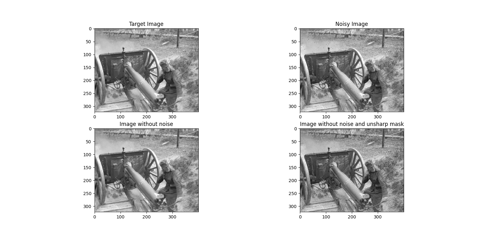
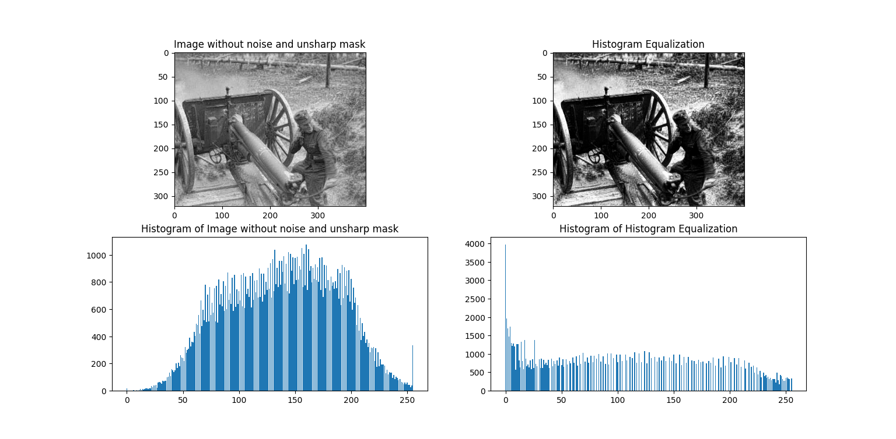
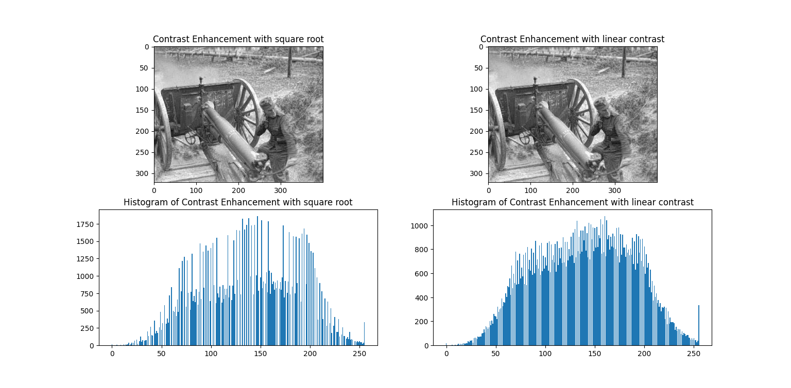
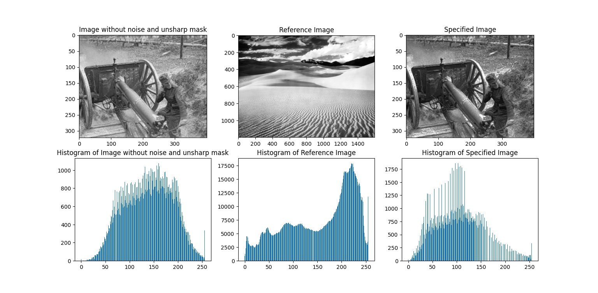
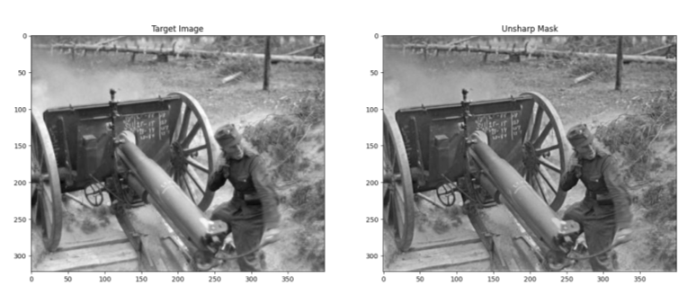

# Image Enhancement and Impulsive Noise Removal
Image enhancement and impulsive noise removal using unsharp mask and adaptive image processing

## Methodology

### 8-neighbor pixels

### EV neighbors method

### Noise removal formula

### Unsharp masking formula

## Target image, Noisy image, Image without noise, Image without noise and unsharp mask

## Image enhancement using different methods

### Histogram equalization

### Histogram equalization using funcions

### Histogram Specification

## Unsharp masking with different C values

### C = 0.5

### C = 1.0

### C = 2.0

